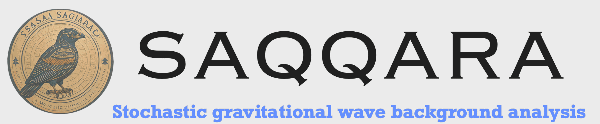
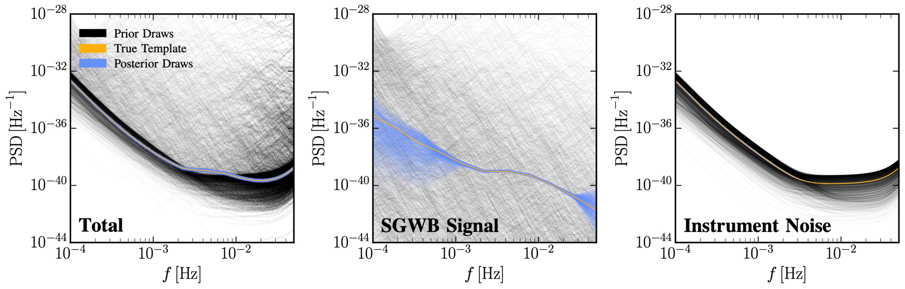

[](https://github.com/PEREGRINE-GW/saqqara) [](https://arxiv.org/abs/2309.07954) [](https://arxiv.org/abs/2408.00832)
## Description
# v0.0.2 now available | August 2024
###### *"Discovered during the 1898 excavation of the tomb of Pa-di-Imen in Saqqara, Egypt, the ***SAQQARA*** bird artifact is dated to about 200 BCE and is of unresolved origin."*

- **SAQQARA** is a Simulation-based Inference (SBI) library designed to perform analysis on stochastic gravitational wave (background) signals (SGWB). It is built on top of the [swyft](https://swyft.readthedocs.io/en/lightning/) code, which implements neural ratio estimation to efficiently access marginal posteriors for all parameters of interest.
- **Related papers:** The details regarding the implementation of the TMNRE algorithm and the application to agnostic and template-based SGWB searches (in the presence of sub-threshold transients) is in: [arxiv:2309.07954](https://arxiv.org/abs/2309.07954). Similarly, the application to time-dependent instrumental noice is explored in:  [arxiv:2408.00832](https://arxiv.org/abs/2408.00832)
- **Key benefits:** We show in the above paper a proof-of-principle for simulation-based inference combined with implicit marginalisation (over nuisance parameters) to be very well suited for SGWB data analysis. Our results are additionally validated via comparison to traditional, likelihood-based algorithms.

- **Contacts:** For questions and comments on the code, please contact either [James Alvey](mailto:j.b.g.alvey@uva.nl), [Uddipta Bhardwaj](mailto:u.bhardwaj@uva.nl), or [Mauro Pieroni](mailto:mauro.pieroni@cern.ch). Alternatively feel free to open a github issue.

- **Citation:** If you use SAQQARA in your analysis, or find it useful, we would ask that you please consider citing the following works.
```
@article{Alvey:2023npw,
    author = "Alvey, James and Bhardwaj, Uddipta and Domcke, Valerie and Pieroni, Mauro and Weniger, Christoph",
    title = "{Simulation-based inference for stochastic gravitational wave background data analysis}",
    eprint = "2309.07954",
    archivePrefix = "arXiv",
    primaryClass = "gr-qc",
    reportNumber = "CERN-TH-2023-167",
    month = "9",
    year = "2023"
}
```
```
@article{Alvey:2024uoc,
    author = "Alvey, James and Bhardwaj, Uddipta and Domcke, Valerie and Pieroni, Mauro and Weniger, Christoph",
    title = "{Leveraging Time-Dependent Instrumental Noise for LISA SGWB Analysis}",
    eprint = "2408.00832",
    archivePrefix = "arXiv",
    primaryClass = "gr-qc",
    reportNumber = "CERN-TH-2024-127",
    month = "8",
    year = "2024"
}
```



- e.g. reconstruction of SGWB using SAQQARA.

## Available Branches:
- `main` - Newest release, refactored and modular version of saqqara
- `template-powerlaw` - (Archived) SGWB search using a powerlaw template
- `agnostic` - (Archived) agnostic SGWB search

## Release Details:
- v0.0.2 | *August 2024* | Update with refactored, modular saqqara package + varying noie example
    - [Leveraging Time-Dependent Instrumental Noise for LISA SGWB Analysis](https://arxiv.org/abs/2408.00832)
- v0.0.1 | *September 2023* | Public release matching companion paper: 
    - [Simulation-based inference for stochastic gravitational wave background data analysis](https://arxiv.org/abs/2309.07954)
